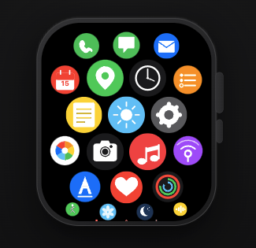

The Apple Watch displays an app selector that looks like a honeycomb grid, which scrolls vertically, and sizes the
app icons with a kind of fisheye distortion.

The user can pan left/right/up/down. The user can scroll and fling vertically. When the user pans or flings beyond
the boundary of the content, a springy overscroll is applied, which pulls the content back into frame.

This UI is a good candidate for a custom render object for the following reasons:
 * Has child widgets
 * Layout of child size and position is nuanced
 * Only visible children should be built, therefore build happens during layout

This example shows you how you might build such a render object.

## Try it Out
Play with the custom render object to observe both the honeycomb layout, as well as scrolling, flinging, and overscroll
behaviors.