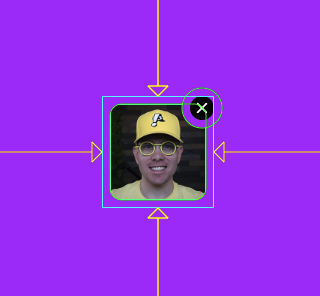
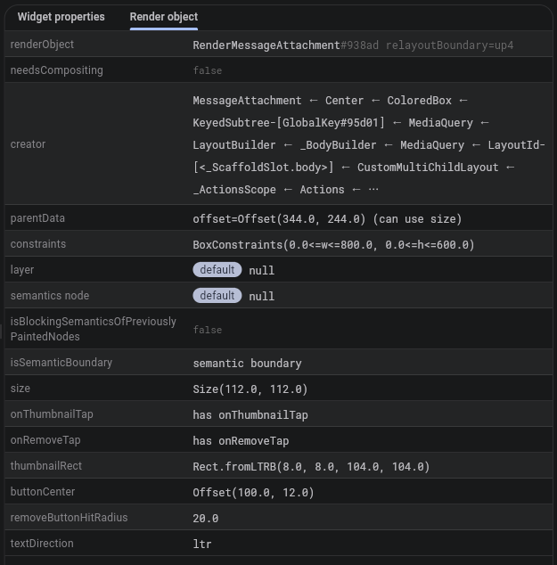

An attachment thumbnail, which might appear in a chat message, which includes an "x" button to
remove the attachment. Notice that the "x" button is separated from the thumbnail with a clipped
gap.


## Why a Custom Render Object?
The attachment widget is simple, but it shows that even simple widgets can sometimes benefit
from a custom render object. The most important detail is that the top right corner of the
thumbnail is clipped with a circle that creates a gap between the thumbnail and the "x"
button. It's as if the "x" button was cut out from the thumbnail.

This attachment thumbnail could be built with a widget tree. However, that widget tree would
be rather confusing. The code within a custom render object more clearly demonstrates the
relationship between cutting the circle out of the thumbnail, and displaying a circular "x"
button.

## Try it Out
The attachment thumbnail doesn't do anything on it's own, but a running version of it is
included below.

<EmbeddedMessageAttachment />

## The Implementation

### Layout
Layout for the message attachment is almost as simple as just calling `layout()` on the `child` thumbnail. However,
because the "x" button slightly extends beyond the boundary of the `child`, the layout process needs to insert
that little gap on all 4 sides of the `child`.

```dart
  @override
  void performLayout() {
    final child = this.child;
    if (child == null) {
      size = constraints.smallest;
      return;
    }

    // Layout the thumbnail child, but subtract the gap that we need for the "x" button
    // to slightly sit outside the thumbnail bounds.
    child.layout(constraints.deflate(const EdgeInsets.all(_removeButtonOverflowDistance)), parentUsesSize: true);

    // The "x" button sits slightly beyond the thumbnail bounds. We add this overflow gap
    // on all 4 sides of the thumbnail. So we need to position the thumbnail down, and to
    // the left, by that amount.
    (child.parentData! as BoxParentData).offset = const Offset(
      _removeButtonOverflowDistance,
      _removeButtonOverflowDistance,
    );

    // Our size is the size of the thumbnail, plus the "x" button overflow distance, added
    // to all 4 sides.
    size = constraints.constrain(
      Size(child.size.width + _removeButtonOverflowDistance * 2, child.size.height + _removeButtonOverflowDistance * 2),
    );
  }
```

The message attachment should also support dry layout.

```dart
  @override
  Size computeDryLayout(BoxConstraints constraints) => child != null
      ? constraints.constrain(
          child!.getDryLayout(constraints.deflate(const EdgeInsets.all(_removeButtonOverflowDistance))) +
              const Offset(_removeButtonOverflowDistance * 2, _removeButtonOverflowDistance * 2),
        )
      : constraints.smallest;
```

### Intrinsic Sizing
The message attachment is basically a thumbnail plus a little extra padding. Therefore, the message attachment
has an intrinsic size.

Whenever a render object can reasonably report an intrinsic size, it should do so. This maximizes the places
it can be used without throwing layout errors.

```dart
  @override
  double computeMinIntrinsicWidth(double height) => child != null
      ? child!.getMinIntrinsicWidth((height - _removeButtonOverflowDistance * 2).clamp(0.0, double.infinity)) +
            _removeButtonOverflowDistance * 2
      : 0;

  @override
  double computeMaxIntrinsicWidth(double height) => child != null
      ? child!.getMaxIntrinsicWidth((height - _removeButtonOverflowDistance * 2).clamp(0.0, double.infinity)) +
            _removeButtonOverflowDistance * 2
      : 0;

  @override
  double computeMinIntrinsicHeight(double width) => child != null
      ? child!.getMinIntrinsicHeight((width - _removeButtonOverflowDistance * 2).clamp(0.0, double.infinity)) +
            _removeButtonOverflowDistance * 2
      : 0;

  @override
  double computeMaxIntrinsicHeight(double width) => child != null
      ? child!.getMaxIntrinsicHeight((width - _removeButtonOverflowDistance * 2).clamp(0.0, double.infinity)) +
            _removeButtonOverflowDistance * 2
      : 0;
```

### Paint
Painting the message attachment includes 3 responsibilities:

 1. Paint the thumbnail with rounded corners
 2. Cut out a circle in the top-right corner of the thumbnail
 3. Paint a circular "x" button at the center of the clipped circle

The painting process is mostly straight forward. The one unusual detail is that to paint with a
clip path, a compositing layer must be used.

```dart
  @override
  void paint(PaintingContext context, Offset offset) {
    final child = this.child;
    final childRect = _thumbnailRect;
    if (child == null || childRect == null) {
      layer = null;
      return;
    }

    final childParentData = child.parentData! as BoxParentData;
    final Offset buttonCenter = _buttonCenter!;
    
    // Create a clipping path for the thumbnail that rounds the corners and also punches out
    // a circle around the location where the "x" button will be painted.
    final Path clipPath = Path.combine(
      PathOperation.difference,
      Path()..addRRect(_thumbnailRRect!),
      Path()..addOval(Rect.fromCircle(center: buttonCenter, radius: _removeButtonHitRadius)),
    );

    layer = context.pushClipPath(
      needsCompositing,
      offset,
      childRect,
      clipPath,
      (context, offset) => context.paintChild(child, offset + childParentData.offset),
      oldLayer: layer as ClipPathLayer?,
    );

    _paintRemoveButton(context, offset + buttonCenter);
  }
```

### Hit Testing
The message attachment is mostly hittable, but not entirely. There's a thin invisible gap around the thumbnail. The
message attachment should not report itself as being visible in that gap.

A somewhat custom hit testing implementation makes sure not to report hits in the gap around the thumbnail.

```dart
  @override
  bool hitTest(BoxHitTestResult result, {required Offset position}) {
    if (size.contains(position)) {
      // Delegate to `hitTestSelf()` and `hitTestChildren()`.
      return super.hitTest(result, position: position);
    }

    if (_isWithinRemoveButtonHitArea(position)) {
      // Hit test location is outside our standard `RenderBox` bounds, but
      // the hit test location might still hit our circular "x" button because
      // the "x" button hit area is larger than its paint area.
      result.add(BoxHitTestEntry(this, position));
      return true;
    }

    return false;
  }

  @override
  bool hitTestSelf(Offset position) {
    if (child == null) {
      return false;
    }

    // Return `true` if the position is inside the thumbnail, or within the hit
    // area of the "x" button.
    return _thumbnailRRect!.contains(position) || _isWithinRemoveButtonHitArea(position);
  }

  @override
  bool hitTestChildren(BoxHitTestResult result, {required Offset position}) => child != null
      ? result.addWithPaintOffset(
          offset: (child!.parentData! as BoxParentData).offset,
          position: position,
          hitTest: (result, transformed) => child!.hitTest(result, position: transformed),
        )
      : false;
```

### Gesture Recognition
The message attachment includes callbacks for a tap on the thumbnail and a tap on the "x" button.

If the whole render object had just one tap gesture for the whole area, this gesture recognition could
be done in the widget tree using a `GestureDetector`. However, there are two different tappable areas
in the message attachment, and the difference between those areas is determined by the internal layout
logic of the message attachment. Therefore, the message attachment handles its own gesture recognition.

```dart
  RenderMessageAttachment({
    VoidCallback? onThumbnailTap,
    VoidCallback? onRemoveTap,
    required TextDirection textDirection,
  }) : _onThumbnailTap = onThumbnailTap,
       _onRemoveTap = onRemoveTap,
       _textDirection = textDirection {
    _tap = TapGestureRecognizer()..onTapUp = _handleTapUp;
  }

  @override
  void dispose() {
    _tap.dispose();
    super.dispose();
  }

  late final TapGestureRecognizer _tap;

  @override
  void handleEvent(PointerEvent event, covariant BoxHitTestEntry entry) {
    if (event is PointerDownEvent) {
      _tap.addPointer(event);
    }
  }

  void _handleTapUp(TapUpDetails details) {
    final Offset local = details.localPosition;

    if (_isWithinRemoveButtonHitArea(local)) {
      _onRemoveTap?.call();
      return;
    }

    final thumbnailRRect = _thumbnailRRect;
    if (thumbnailRRect != null && thumbnailRRect.contains(local)) {
      _onThumbnailTap?.call();
    }
  }
```

### Debug Paint
Debug paint is a great way to inspect important boundaries in a render object. For the message attachment, we
paint debug bounds around the thumbnail tap area, and the "x" button tap area.



This debug paint was implemented as follows:

```dart
  @override
  void debugPaint(PaintingContext context, Offset offset) {
    super.debugPaint(context, offset);

    if (debugPaintSizeEnabled) {
      final thumbnailRRect = _thumbnailRRect;
      final buttonCenter = _buttonCenter;
      if (thumbnailRRect == null || buttonCenter == null) {
        return;
      }

      final Paint hitAreaPaint = Paint()
        ..color = const Color(0xFF00FF00)
        ..style = PaintingStyle.stroke
        ..strokeWidth = 1.0;

      // These mirror the exact shapes used for hit testing: the rounded
      // rect checked in `_handleTapUp`'s thumbnail branch, and the (larger
      // than the painted circle) radius checked in `_isWithinButtonHitArea`.
      context.canvas.drawRRect(thumbnailRRect.shift(offset), hitAreaPaint);
      context.canvas.drawCircle(offset + buttonCenter, _removeButtonHitRadius, hitAreaPaint);
    }
  }
```

### Semantics
The message attachment creates a semantics boundary so that it doesn't merge with any ancestor semantics nodes.

The message attachment uses semantics to report its text direction, a label for its meaning, registers itself
as a button because the thumbnail and "x" act as buttons, and registers both of its tap callbacks.

```dart
  @override
  void describeSemanticsConfiguration(SemanticsConfiguration config) {
    super.describeSemanticsConfiguration(config);

    // Force this render object to own a distinct SemanticsNode instead of
    // possibly merging upward into an ancestor's (which could silently drop
    // one of two conflicting `onTap` handlers, or trip the framework's
    // "incompatible configuration" assertion). Merge the child's semantics
    // (if it has any, e.g. an image label) down into this same node, since
    // a nested node under a generic "Attachment thumbnail" label would just
    // be a confusing extra stop for screen readers.
    config.isSemanticBoundary = true;
    config.isMergingSemanticsOfDescendants = true;

    if (_onThumbnailTap != null) {
      config.onTap = _onThumbnailTap;
    }

    // The remove button has no backing render object of its own — it's
    // custom-painted and custom-hit-tested by this render object — so its
    // action is exposed as a custom action on this same semantics node
    // rather than as a separate, independently-focusable node.
    config.textDirection = _textDirection;
    config.label = 'Attachment thumbnail';
    config.isButton = _onThumbnailTap != null;
    if (_onRemoveTap != null) {
      config.customSemanticsActions = <CustomSemanticsAction, VoidCallback>{
        const CustomSemanticsAction(label: 'Remove attachment'): _onRemoveTap!,
      };
    }
  }
```

### Debug Properties
Similar to reporting semantics, the message attachment has a number of properties to report to Flutter's debugging system.

```dart
  @override
  void debugFillProperties(DiagnosticPropertiesBuilder properties) {
    super.debugFillProperties(properties);
    properties
      ..add(ObjectFlagProperty<VoidCallback?>.has('onThumbnailTap', _onThumbnailTap))
      ..add(ObjectFlagProperty<VoidCallback>.has('onRemoveTap', _onRemoveTap))
      ..add(DiagnosticsProperty<Rect?>('thumbnailRect', _thumbnailRect, defaultValue: null))
      ..add(DiagnosticsProperty<Offset?>('buttonCenter', _buttonCenter, defaultValue: null))
      ..add(DoubleProperty('removeButtonHitRadius', _removeButtonHitRadius))
      ..add(EnumProperty<TextDirection>('textDirection', _textDirection));
  }
```

With `debugFillProperties()` implemented, the Flutter debugger shows property values at runtime:



### Full Source Code
This example shows the most important implementation details for the message attachment. You can view the full source:

TODO: Link to repo.