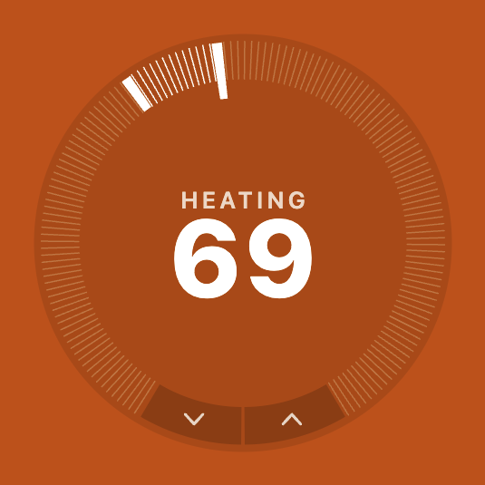
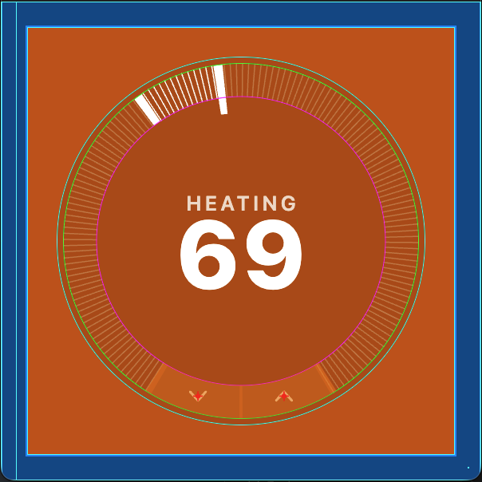
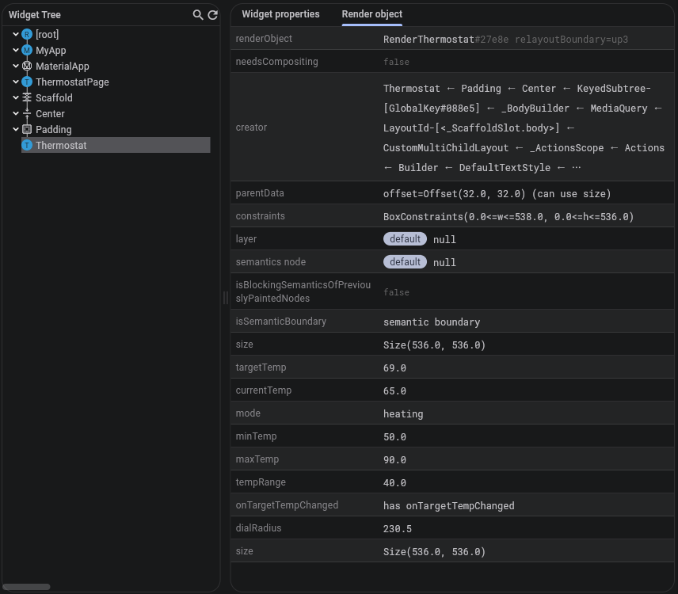

Nest created the concept of a learning thermostat, which optimizes temperature to reduce energy use and save money.

In this example, we'll create a custom render object that looks similar to the thermostat in the Nest app.

## The Goal
TODO:

## What We're Faking
The goal of this example is to demonstrate render object behavior. As such, this example fakes various pieces of information and state
that would otherwise come from a physical device and/or server.

Surrounding the thermostat widget/render object is the following scaffold of fake temperature information:

```dart
class _ThermostatPageState extends State<ThermostatPage> {
  static const double _currentTemp = 65;

  double _targetTemp = 72;

  ThermostatMode get _mode {
    if (_targetTemp > _currentTemp) return ThermostatMode.heating;
    if (_targetTemp < _currentTemp) return ThermostatMode.cooling;
    return ThermostatMode.off;
  }

  @override
  Widget build(BuildContext context) {
    return Scaffold(
      backgroundColor: Colors.black,
      body: Center(
        child: Padding(
          padding: const EdgeInsets.all(32),
          // This is our Thermostat widget, which includes our custom render object.
          child: Thermostat(
            targetTemp: _targetTemp,
            currentTemp: _currentTemp,
            mode: _mode,
            minTemp: 50,
            maxTemp: 90,
            // This callback allows our thermostat render object to change the
            // fake target temperature using taps and drags, within itself.
            onTargetTempChanged: (t) => setState(() => _targetTemp = t),
          ),
        ),
      ),
    );
  }
}
```

## The Implementation

### Layout
Layout has two responsibilities: choose a `size`, and layout children. The thermostat has no children, so it just needs to select a `size`.
As a matter of preference, the thermostat makes itself into a square that fits within the given constraints.

```dart
  @override
  void performLayout() {
    size = _squareSize(constraints);
  }
```

Technically, this render object only needs to select a `size` during layout. However, the thermostat includes some text, which means it
should support the concept of a text "baseline".

Render objects have a method called `computeDistanceToActualBaseline(baseline)`, which needs to be implemented by the thermostat, to
report back to Flutter where the text baseline sits within the render object. An important thing to know about `computeDistanceToActualBaseline(baseline)`
is that it's called after `layout()` but before `paint()`. So if we only layout text during `paint()`, then `computeDistanceToActualBaseline(baseline)`
won't yet know where the baseline sits. Therefore, the thermostat runs layout on its text during `layout()` so that `computeDistanceToActualBaseline(baseline)`
can return the correct value before `paint()` runs.

```dart
  @override
  void performLayout() {
    size = _squareSize(constraints);

    // Calculate text layout during layout instead of paint, to support baseline
    // reporting.
    //
    // The debug baseline query might happen before `paint()` is called, but
    // it's called after `layout()`. We measure here so that the results are
    // available to both the baseline query, and to `paint()`, instead of
    // running this measurement in two different places.
    final width = size.width;
    final textPainter = TextPainter(
      text: TextSpan(
        text: _targetTemp.round().toString(),
        style: TextStyle(
          fontSize: width * 0.22,
          fontWeight: FontWeight.w800,
          height: 1.0,
        ),
      ),
      textDirection: TextDirection.ltr,
    )..layout();
    final modeOffset = _mode != ThermostatMode.off ? width * 0.04 : 0.0;
    final textTop = size.height / 2 + modeOffset - textPainter.height / 2;
    for (final baseline in TextBaseline.values) {
      _baselines[baselines] = textTop + textPainter.computeDistanceToActualBaseline(baseline);
    }
  }

  Size _squareSize(BoxConstraints constraints) {
    final side = math.min(
      // Note: We arbitrarily choose 300px as our intrinsic width/height when
      //       no bounds are given.
      constraints.maxWidth.isFinite ? constraints.maxWidth : 300.0,
      constraints.maxHeight.isFinite ? constraints.maxHeight : 300.0,
    );
    return constraints.constrain(Size(side, side));
  }

  /// Returns the distance from the top of the widget to the alphabetic or
  /// ideographic baseline of the temperature numeral, so the thermostat can
  /// participate in baseline-aligned rows.
  @override
  double? computeDistanceToActualBaseline(TextBaseline baseline) =>
      _baselines[baseline];
```

### Paint
Paint puts all the pixels on the screen. The Nest-style thermostate needs to paint a background, a temperature dial, up/down buttons, the
current temperature, and the current heating/cooling mode text.

The specific `Canvas` calls aren't the focus of this example, so the following code shows you the `paint()` method, but not the
individual methods that paint the various shapes and paths.

```dart
  @override
  void paint(PaintingContext context, Offset offset) {
    final canvas = context.canvas;
    canvas.save();
    canvas.translate(offset.dx, offset.dy);

    _paintBackground(canvas);
    _paintTicks(canvas);
    _paintButtonArcs(canvas);
    _paintCenterText(canvas);
    _paintButtons(canvas);

    canvas.restore();
  }
```

The `paint()` method renders the thermostat:



### Hit Testing
Hit testing tells Flutter what region on the screen presents the thermostat. While only part of the thermostat involves gestures, the
whole rectangle visually presents the thermostat. Therefore, the thermostat render object reports its entire self as hittable.

```dart
  @override
  bool hitTestSelf(Offset position) => true;
```

### Gesture Recognition
The thermostat has a dial that can be tapped or dragged. It also has up/down buttons that can be tapped. These gesture regions
are their own concern, beyond merely hit testing. These gestures must be handled with the standard gesture recognition system, but
registered inside the render object, instead of registered in the widget tree.

The thermostat must track its owner gestures so that it knows when/how to respond to them. First, the thermostat declares its
gesture trackers and a couple accounting variables.

```dart
late final TapGestureRecognizer _tap;
late final PanGestureRecognizer _pan;
double? _lastPanAngle;
double _panAccum = 0;
```

The thermostat is responsible for initializing and disposing the recognizers.

```dart
  // Initialization
  RenderThermostat({ /**/ }) {
    _tap = TapGestureRecognizer()..onTapUp = _onTapUp;

    _pan = PanGestureRecognizer()
      ..onStart = _onPanStart
      ..onUpdate = _onPanUpdate;

    //...
  }

  // Disposal
  @override
  void dispose() {
    _tap.dispose();
    _pan.dispose();

    super.dispose();
  }
```

All `RenderBox`s have a method that's called when a gesture interacts with it. The thermostat wants to track certain gestures, so
the thermostat needs to forward these notifications to its own gesture trackers.

```dart
  @override
  void handleEvent(PointerEvent event, BoxHitTestEntry entry) {
    if (event is PointerDownEvent) {
      _tap.addPointer(event);
      _pan.addPointer(event);
    }
  }
```

Now that the recognizers are initialized and disposed as needed, and pointer events are being routed to both recognizers, it's time
to define the actions that should happen when the user taps or pans.

```dart
  void _onTapUp(TapUpDetails d) {
    final pos = d.localPosition;
    switch (_buttonAt(pos)) {
      case _ButtonHit.down:
        // User tapped the down button.
        _emit((_targetTemp - 1).clamp(_minTemp, _maxTemp));
        return;
      case _ButtonHit.up:
        // User tapped the up button.
        _emit((_targetTemp + 1).clamp(_minTemp, _maxTemp));
        return;
      case _ButtonHit.none:
        break;
    }

    if (_onRing(pos)) {
      // User tapped somewhere on the temperature dial.
      final angle = _rawAngle(pos);
      if (_angleInDial(angle)) {
        _emit(_angleToTemp(angle).roundToDouble());
      }
    }
  }

  void _onPanStart(DragStartDetails d) {
    // The user started panning.
    _lastPanAngle = _rawAngle(d.localPosition);
    _panAccum = _targetTemp;
  }

  void _onPanUpdate(DragUpdateDetails d) {
    if (_lastPanAngle == null) {
      return;
    }

    // Accumulate distance along the temperature dial as the user pans.
    final cur = _rawAngle(d.localPosition);
    var delta = cur - _lastPanAngle!;
    // Normalize to (−π, π] so short-arc motion never wraps the temperature.
    while (delta > math.pi) { 
      delta -= _kTwoPi; 
    }
    while (delta < -math.pi) { 
      delta += _kTwoPi; 
    }
    _lastPanAngle = cur;

    // Accumulate as float so slow drags don't stutter; emit as integer.
    _panAccum = (_panAccum + delta / _kSweepAngle * (_maxTemp - _minTemp))
            .clamp(_minTemp, _maxTemp);

    // Update the desired temperature based on how far along the dial
    // the user has dragged.
    _emit(_panAccum.roundToDouble());
  }

  void _emit(double temp) => _onTargetTempChanged?.call(temp);
```

With the above code, the user can tap up/down buttons, tap the temperature dial, and drag the temperature dial to change the desired temperature.

### Debug Paint
The Nest-style thermostat is a great example for debug paint. The user can see the final painting, but a developer can't see the touch
regions. Let's use debug paint to display those touch regions, which can help diagnose touch interaction bugs.



The following code sample includes some naunced paint logic. That behavior isn't particularly important. Instead, the
important part is the use of `debugPaint()` to conditionally paint extra paths and shapes for developers.

```dart
  @override
  void debugPaint(PaintingContext context, Offset offset) {
    super.debugPaint(context, offset);

    // The `debugPaint()` method is always run for debug builds, not just when
    // debugging tools activate guidelines. To make sure we only paint these
    // paths when a developer asks for it, we need to check one of Flutter's
    // standard debug paint variables. If it's `false`, we paint nothing.
    if (!debugPaintSizeEnabled) {
      return;
    }

    // The following code paints paths around the dial regions that are
    // tappable and draggable. This helps debug gesture issues.
    //
    // This code is placed into an assert() so that it's not even compiled
    // into a release build. By doing this in all render objects, the size
    // of the release build is reduced, and it's guaranteed that this code
    // will never run in production.
    assert(() {
      final canvas = context.canvas;
      canvas.save();
      canvas.translate(offset.dx, offset.dy);

      final c = _center;
      final r = _dialR;
      const inset = 8.0;
      const len = 0.18;
      final outerR = r - inset;
      final innerR = outerR - len * r;
      final arcR = (outerR + innerR) / 2;

      // Dial outer boundary (where the ring sits against the background).
      _circle(r, const Color(0xFF00FFFF));
      // Outer edge of notch band.
      _circle(outerR, const Color(0xFF00FF00));
      // Inner edge of notch band.
      _circle(innerR, const Color(0xFFFF00FF));

      // Gap arc — the region reserved for buttons, filled with a translucent
      // orange stroke at the mid-radius of the notch band.
      final gapStart = _kStartAngle + _kSweepAngle;
      final gapSweep = _kTwoPi - _kSweepAngle;
      canvas.drawArc(
        Rect.fromCircle(center: c, radius: arcR),
        gapStart,
        gapSweep,
        false,
        Paint()
          ..color = const Color(0x80FF8000)
          ..style = PaintingStyle.stroke
          ..strokeWidth = outerR - innerR
          ..strokeCap = StrokeCap.butt,
      );

      // Button centre markers — red crosshairs at each button's logical centre.
      for (final deg in [_kUpArcCenterDeg, _kDownArcCenterDeg]) {
        final pos = _buttonCenter(deg);
        const arm = 6.0;
        final paint = Paint()
          ..color = const Color(0xFFFF0000)
          ..strokeWidth = 1.5;
        canvas.drawLine(pos - Offset(arm, 0), pos + Offset(arm, 0), paint);
        canvas.drawLine(pos - Offset(0, arm), pos + Offset(0, arm), paint);
        canvas.drawCircle(pos, 3, Paint()..color = const Color(0xFFFF0000));
      }

      canvas.restore();
      return true;
    }());
  }

  void _circle(double radius, Color color) => canvas.drawCircle(
    c,
    radius,
    Paint()
        ..color = color
        ..style = PaintingStyle.stroke
        ..strokeWidth = 1.0,
    );
```

### Semantics
The thermostat needs to advertise the current temperature, the target temperature, heating/coooling mode, and the ability to increase/decrease 
the target temperature.

```dart
  @override
  void describeSemanticsConfiguration(SemanticsConfiguration config) {
    super.describeSemanticsConfiguration(config);

    final target = _targetTemp.round();
    final increased = (target + 1).clamp(_minTemp.round(), _maxTemp.round());
    final decreased = (target - 1).clamp(_minTemp.round(), _maxTemp.round());

    config
      ..isSemanticBoundary = true
      ..isEnabled = true
      ..label = 'Thermostat'
      ..value =
          '$target degrees, $_modeLabel, '
          'current temperature ${_currentTemp.round()} degrees'
      ..increasedValue = '$increased degrees'
      ..decreasedValue = '$decreased degrees'
      ..hint = 'Swipe up or down to adjust target temperature';

    config.onIncrease = _onTargetTempChanged == null
        ? null
        : () => _emit((target + 1).toDouble().clamp(_minTemp, _maxTemp));

    config.onDecrease = _onTargetTempChanged == null
        ? null
        : () => _emit((target - 1).toDouble().clamp(_minTemp, _maxTemp));
  }
```

### Debug Properties
Similar to reporting semantics, the thermostat has a number of properties to report to Flutter's debugging system.

```dart
  @override
  void debugFillProperties(DiagnosticPropertiesBuilder properties) {
    super.debugFillProperties(properties);
    properties
      ..add(DoubleProperty('targetTemp', _targetTemp))
      ..add(DoubleProperty('currentTemp', _currentTemp))
      ..add(EnumProperty<ThermostatMode>('mode', _mode))
      ..add(DoubleProperty('minTemp', _minTemp))
      ..add(DoubleProperty('maxTemp', _maxTemp))
      ..add(DoubleProperty('tempRange', _maxTemp - _minTemp))
      ..add(ObjectFlagProperty<ValueChanged<double>>.has('onTargetTempChanged', _onTargetTempChanged))
      ..add(DoubleProperty('dialRadius', hasSize ? _dialR : null, defaultValue: null))
      ..add(DiagnosticsProperty<Size>('size', hasSize ? size : null, defaultValue: null));
  }
```

With `debugFillProperties()` implemented, the Flutter debugger shows property values at runtime:



## Full Source Code
This example shows the most important implementation details for the Nest-style thermostat. You can view the full source:

TODO: Link to repo.

## Similar Implementations
The approach in this example isn't unique to a Nest thermostat. A similar approach would work equally well for various other render objects:

 * A variety of graphs and charts (e.g., candlestick stock chart)
